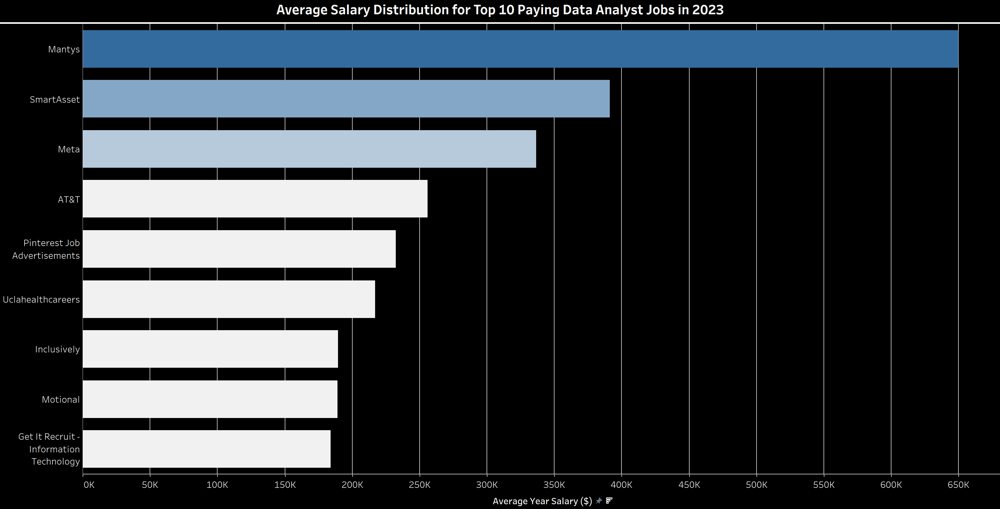
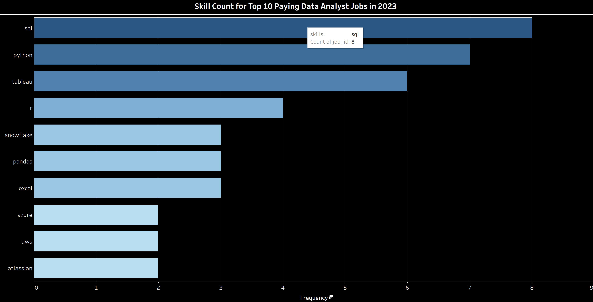
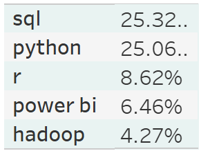
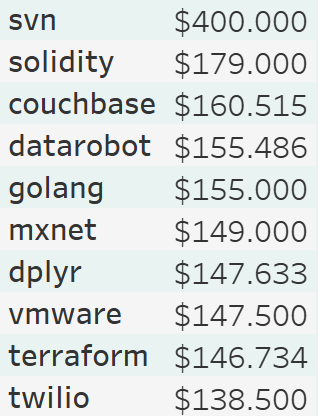
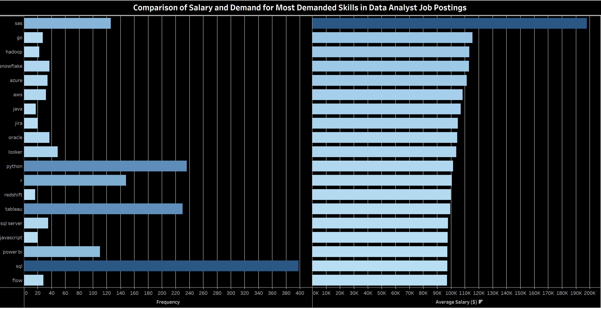

# Introduction
This project focuses on analyzing top-paying jobs and in-demand skills for Data Analysts by utilizing SQL queries to examine job postings data. The analysis provides insights into which skills lead to higher salaries and greater demand for Data Analysts in 2023. These insights are especially relevant in the current job market where data-driven decision-making is paramount across industries.

The data sourced from [Luke Barousse's SQL Course](https://www.lukebarousse.com/sql) which provides a foundation for my analysis, containing detailed information on job titles, salaries, locations, and essential skills. Through a series of SQL queries and Tableau visualisations, I explore key questions such as the most demanded skills, salary trends, and the intersection of demand and salary in data analytics.

# Tools I Used
In this project, the following tools were utilized:

**- SQL:** For querying and filtering the dataset to extract insights on salaries and required skills.

**- Tableau:** A powerful data visualization tool used to create charts and graphs, making the results of the SQL queries easier to interpret and share.

**- Visual Studio Code:** A versatile code editor used to write and organize SQL queries and manage project files.

**- PostgreSQL:** The database management system that stored the job posting data and allowed for efficient querying with SQL.

**- GitHub:** A version control platform used for managing project files, collaborating on code, and sharing the final analysis results.

# The Analysis

## 1. Top Paying Data Analyst Jobs
### Process Overview:
In this analysis, we focused on identifying the highest-paying remote "Data Analyst" positions from the dataset. The process involved several key steps to ensure we filtered and analyzed only relevant data:

- **Data Filtering:** We first filtered the dataset to focus on job titles containing "Data Analyst." Additionally, since we were specifically interested in remote jobs, we narrowed the scope further to include only jobs that were listed as remote or hybrid/remote in the job schedule type.

- **Handling Null Values:** Rows where the salary information (salary_year_avg) was missing were excluded to ensure we were analyzing complete data.

- **Sorting and Limiting:** After filtering for relevant roles, the data was sorted by annual salary in descending order to identify the highest-paying positions, and we displayed the top 10 results for remote or hybrid roles.

Here's the entire query: [1_top_paying_jobs.sql](\1_top_paying_jobs.sql)

### Outcome:
The top 10 highest-paying remote Data Analyst jobs were identified through this process. Key results include:

- **Maximum Salary:** The highest-paying remote job in the dataset offers a substantial salary of 650,000 at Mantys.
- **Wide Salary Range:** Salaries for remote positions range from 189,000 to 650,000, which shows a significant variation depending on the employer, job responsibilities, and possibly location flexibility.
- **Diverse Employers:** The remote/hybrid roles are spread across various companies, including Pinterest and Uclahealthcareers, which highlights the diversity of companies offering flexible working conditions for high-paying roles.
- **Commitment:** All roles analyzed were full-time positions, which suggests that high-paying "Data Analyst" roles often come with significant time commitments even when offered remotely.
### Insights:

*Bar graph visualising the salary for the top 10 salaries for data analysts; This graph was created with Tableau from my SQL query results*

- The significant range in salary—from 189,000 to 650,000—suggests that companies may be willing to pay top dollar for specialized or senior roles, such as "Principal Data Analyst."
- The wide variety of companies offering these high-paying remote roles, from startups to established firms, demonstrates that competitive compensation is available across different sectors and company sizes.
- The job market for remote data analysts appears to be robust, and candidates with the right skill set can access high-paying opportunities without being restricted by location. 

## 2. Skills for Top Paying Jobs
### Process Overview:
In this analysis, we focused on enriching the previous outcome with the required skills. The process begins with the creation of a CTE (Common Table Expression) for remote 'Data Analyst' jobs. The CTE is then joined with the corresponding tables in order for company names and relevant skills to be retreived.

Here's the entire query: [2_top_paying_job_skills.sql](\2_top_paying_job_skills.sql)

### Outcome:
**- Top Skills Required:**
SQL is the most frequently required skill, appearing in 8 of the 10 highest-paying jobs. This emphasizes the importance of proficiency in SQL for high-paying data roles.
Python and Tableau follow closely, appearing in 6 jobs each, indicating the importance of data manipulation and visualization tools.

**- Other Key Skills:**
R and Snowflake are featured in 4 job postings, showing the relevance of statistical programming and cloud-based data warehousing for these roles.
Azure, AWS, and Atlassian are mentioned in some positions, demonstrating the growing demand for cloud infrastructure and project management tools.

**- Technical Expertise:**
The range of skills required highlights the demand for a broad set of technical capabilities, from traditional tools like Excel to more advanced tools such as Databricks and cloud platforms.

### Insights:

*Bar graph visualising the frequency of required skills for the top paying Data Analyst jobs; This graph was created with Tableau from my SQL query results*

This visualization makes it easy to see that SQL, Python, and Tableau are critical for securing top-paying positions, while cloud infrastructure skills (Azure, AWS) are becoming increasingly important.

## 3. In-Demand Skills for Data Analysts
### Process Overview:
This query focuses on identifying the most demanded skills for Data Analyst roles in 2023 by extracting the top skills used in Data Analyst job postings.

Here's the entire query: [3_top_demanded_skills.sql](\3_top_demanded_skills.sql)

### Outcome:
- SQL and Python are the most demanded skills, with over 25% of job postings requiring these two skills. These programming languages are essential for Data Analysts, especially for data manipulation and processing.

- R comes in third with a notable 8.62% of job postings, indicating that statistical programming remains a crucial skill in analytics roles.

- Power BI and Tableau are highly sought after, reflecting the increasing importance of data visualization tools in communicating insights and findings.

- Big Data technologies like Hadoop are also in demand, with 4.27% of job postings requiring knowledge of this tool, signifying the growing role of big data in analytics.

- Cloud skills like Azure and AWS are becoming more important, with around 3% of job postings requiring these skills, showing the trend towards cloud-based data storage and analysis.

### Insights:

The top 5 most demanded skills for Data Analysts in 2023 include a mix of essential programming languages (SQL, Python, R), data visualization tools (Power BI), and big data/cloud technologies (Hadoop).

## 4. Skills Based on Salary
### Process Overview:
The query was executed to retrieve the average salary associated with specific skills for Data Analyst roles. The query joins job postings with the skills required and calculates the average yearly salary for each skill. The results are then ordered by the highest average salary to highlight the top-paying skills.

Here's the entire query: [4_top_paying_skills.sql](\4_top_paying_skills.sql)

### Outcome:
**- Specialized Skills Yield High Salaries:**
The top-paying skills, such as SVN, Solidity, and Couchbase, are highly specialized and often tied to specific industries or advanced technologies (e.g., blockchain, big data). This suggests that Data Analysts with niche skills can command significantly higher salaries.

**- Automation and AI Expertise is in Demand:**
Tools like DataRobot and MXNet show that machine learning, AI, and automation platforms are associated with higher salaries. Data Analysts who can work with these advanced tools are highly sought after.

**- Cloud and Infrastructure Skills are Essential:**
Skills such as VMware and Terraform highlight the importance of cloud infrastructure and automation in modern data environments. As more companies move to the cloud, Data Analysts with cloud expertise can expect higher compensation.

**- Programming and Data Manipulation:**
Programming languages like Golang and Dplyr remain essential, with high demand for those who can efficiently manage and manipulate data.

### Insights:

This analysis reveals that niche skills in version control, blockchain, machine learning, cloud infrastructure, and big data are among the most lucrative for Data Analysts in 2023. Developing these specialized skills can lead to significantly higher salary opportunities in the field.

## 5. Most Optimal Skills To Learn
### Process Overview:
This analysis identifies the most optimal skills for Data Analysts working in remote positions, focusing on the frequency of job postings and the associated average salary. The analysis is based on the following SQL query: [5_optimal_skills.sql](\5_optimal_skills.sql)

The query retrieves skills associated with remote Data Analyst roles, calculating both the count of job postings and the average yearly salary for each skill.
The query only considers skills that appear in more than 15 job postings and orders the results by average salary in descending order, followed by skill count.
The final result displays the top 20 skills by average payment.
 

### Outcome:
**- Top-Paying Skills:**
The highest-paying skills for remote Data Analyst roles are Go, Hadoop, and Snowflake, with average salaries ranging from $112,948 to $115,320.
These skills are highly specialized, indicating that expertise in specific technologies (e.g., big data tools and modern programming languages) can command premium salaries.

**- Cloud and Big Data Skills Dominate:**
Skills related to cloud infrastructure (Azure, AWS) and big data technologies (Hadoop, Snowflake, Redshift) are among the top-paying, reflecting the increasing demand for cloud-based solutions and data warehousing.

**- Widespread Skills with High Demand:**
SQL, Python, and Tableau are among the most commonly required skills, with SQL appearing in 398 job postings, the highest count in the dataset. Although the average salaries for these skills are slightly lower, their widespread demand makes them essential for most Data Analysts.

**- Visualization and Reporting Tools:**
Looker, Power BI, and Tableau appear frequently in job postings, with solid average salaries. These tools highlight the importance of data visualization and reporting skills in the modern data landscape.

**- Programming Languages and Tools:**
Programming languages like Go, Java, Python, and R are consistently in demand, demonstrating the need for versatile technical skills in data analysis roles.

### Insights:

*Bar graph visualising the frequency of required skills and their corresponding avergae salary for Data Analyst jobs; This graph was created with Tableau from my SQL query results*

The analysis highlights that Data Analysts who specialize in cloud computing, big data technologies, and advanced programming skills can command the highest salaries in remote roles. Skills like Go, Hadoop, and Snowflake lead in terms of salary, while widely used skills like SQL and Python are essential for securing many job opportunities. Focusing on cloud infrastructure, data engineering tools, and programming languages is key for professionals aiming to excel in this field.

# Conclusion
This analysis reveals a detailed look into the most in-demand and highest-paying skills for Data Analysts in 2023. Based on the SQL queries and data visualizations, here are the key conclusions:

1. SQL and Python are critical foundational skills for Data Analysts, as they appear frequently across both high-paying and in-demand roles. Mastering these two programming languages can significantly enhance a Data Analyst's career prospects.
2. Specialized Skills Yield High Salaries: Niche skills like SVN, Solidity, and Couchbase are linked to top-tier salaries, especially in advanced or industry-specific roles such as blockchain and big data.
3. Cloud and Big Data Expertise are Essential: The demand for cloud-related skills like Azure and AWS, as well as big data tools like Hadoop and Snowflake, is on the rise. Professionals who can demonstrate proficiency in these areas are well-positioned to secure high-paying roles.
4. Visualization Tools like Power BI and Tableau are becoming more prominent, making it crucial for Data Analysts to be adept at presenting and interpreting data.

This project emphasized the importance of technical proficiency in data manipulation, querying, and visualization. Professionals who can align their skill sets with the trends identified in this analysis will be better equipped to capitalize on lucrative job opportunities in the data analytics field.